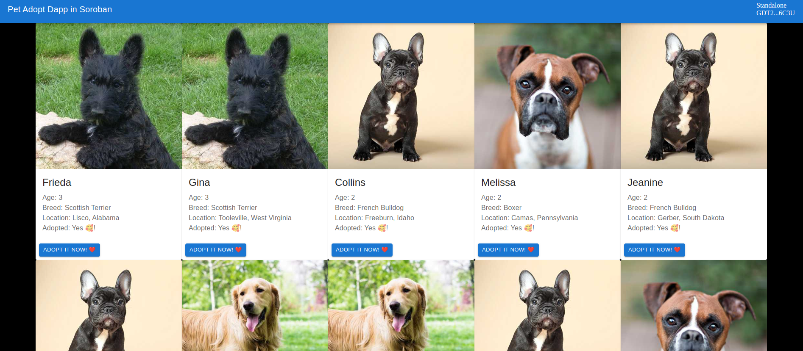

<div align="center">


# 🐶 Pet Adopt Soroban

### Aplicación descentralizada de adopción de mascotas sobre Stellar & Soroban ⚡

<p align="center">
  <b>Pet Adopt Soroban</b> es una dApp construida sobre Stellar utilizando Soroban Smart Contracts y React para gestionar adopciones de mascotas completamente on-chain.
</p>

<p align="center">
  
  
  
  
</p>

<p align="center">
  <a href="#-acerca-del-proyecto">Acerca</a> •
  <a href="#-características">Características</a> •
  <a href="#-tecnologías-utilizadas">Tecnologías</a> •
  <a href="#-instalación">Instalación</a> •
  <a href="#-vista-previa">Vista previa</a>
</p>

</div>

---

# 🌌 Acerca del proyecto

**Pet Adopt Soroban** es una aplicación descentralizada (dApp) inspirada en el clásico proyecto Pet Shop de Ethereum, reconstruida sobre la blockchain de Stellar utilizando Soroban Smart Contracts.

El sistema permite:

- 🐶 Adoptar mascotas
- 🌐 Gestionar ownership descentralizado
- 🔗 Interactuar con smart contracts
- ⚡ Conectar wallets Stellar
- 📋 Consultar adopciones
- 🧩 Ejecutar lógica blockchain
- 🔒 Almacenar datos on-chain

La plataforma fue desarrollada con enfoque en:

- ⚡ Web3 moderno
- 🌐 Blockchain descentralizada
- 🔐 Seguridad on-chain
- 🧩 Smart contracts Soroban
- 📱 Interfaces modernas
- 🚀 Aprendizaje blockchain

---

# ✨ Características

## 🐾 Sistema de adopción

- 🐶 Adopción de mascotas
- ⚡ Registro inmediato on-chain
- 🌐 Ownership descentralizado
- 📋 Gestión de adopciones
- 🔒 Persistencia blockchain

---

## 🌐 Blockchain Integration

- ⭐ Stellar Network
- 🧩 Soroban Smart Contracts
- 🔗 Wallet interaction
- ⚡ Transacciones blockchain
- 🌍 Arquitectura Web3

---

## ⚛️ Frontend interactivo

- 📱 Responsive Design
- ⚡ Actualización dinámica
- 🔔 Feedback visual
- 🌐 React Frontend
- 🧩 Integración blockchain

---

## 📚 Proyecto educativo

- 🎓 Tutorial paso a paso
- 📖 Introducción a Soroban
- ⚡ Ejemplos blockchain
- 🛠️ Aprendizaje práctico
- 🚀 Desarrollo Web3

---

# 👨‍💻 Módulos del sistema

## 🧩 Smart Contract Module

Contrato inteligente principal.

### Funcionalidades:

- 🐶 Adopt pets
- 📦 Blockchain storage
- 🔒 Ownership persistence
- ⚡ Contract execution

---

## ⚛️ React Frontend Module

Interfaz principal de usuario.

### Funcionalidades:

- 📋 Mostrar mascotas
- 🐾 Ejecutar adopciones
- 🔗 Wallet integration
- 🔔 User notifications
- ⚡ Dynamic updates

---

## 🌐 Web3 Integration Module

Módulo de integración blockchain.

### Funcionalidades:

- ⭐ Stellar SDK
- 🔗 Soroban React
- 🌍 Wallet connectivity
- ⚡ Blockchain communication

---

# 🛠️ Tecnologías utilizadas

## ⚙️ Frontend

<p>
  
</p>

- React
- JavaScript
- HTML5
- CSS3
- Create React App

---

## ⚙️ Blockchain & Smart Contracts

<p>
  
</p>

- Soroban Smart Contracts
- Stellar SDK
- Soroban React
- Rust
- Web3 Architecture

---

## 🗄️ Blockchain

<p>
  
</p>

- Stellar Blockchain
- Soroban
- Decentralized Storage
- Smart Contracts
- Wallet Interaction

---

## 🧰 Herramientas

<p>
  
</p>

- Git
- GitHub
- VS Code
- Yarn
- CRA Tooling

---

# 📂 Estructura del proyecto

```bash
AppAdopcionMascotasDescentralizada/
│
├── public/
│   └── images/
├── src/
├── contracts/
├── docs/
├── README.md
├── package.json
└── LICENSE
```

---

# 🏗️ Arquitectura del sistema

## ⚡ Arquitectura general

```text
Usuario → React Frontend → Soroban Smart Contract → Stellar Blockchain
```

---

## 🔄 Flujo del sistema

```text
Usuario → Wallet → Adoptar mascota → Blockchain Storage
```

---

# 📊 Requerimientos funcionales

## 🐶 Funcionalidades principales

- Adopción de mascotas
- Integración Stellar
- Wallet connection
- Smart contracts Soroban
- Gestión de ownership
- Frontend React
- Persistencia blockchain

---

# 🔐 Requerimientos no funcionales

## ⚡ Calidad del sistema

- 🌐 Descentralización
- 🔒 Seguridad blockchain
- ⚡ Respuesta rápida
- 📈 Escalabilidad
- 📱 Compatibilidad multiplataforma
- 🛠️ Código mantenible

---

# ⚡ Instalación

## 📋 Requisitos

- Node.js
- Yarn
- Navegador moderno
- Stellar Wallet
- Git

---

# 🚀 Configuración del proyecto

## 1️⃣ Clonar repositorio

```bash
git clone https://github.com/isairey/AppAdopcionMascotasDescentralizada.git
```

---

## 2️⃣ Entrar al proyecto

```bash
cd AppAdopcionMascotasDescentralizada
```

---

## 3️⃣ Instalar dependencias

```bash
yarn
```

---

## 4️⃣ Ejecutar aplicación

```bash
yarn dev
```

---

## 5️⃣ Abrir aplicación

```bash
http://localhost:3000
```

---

# 📸 Vista previa

## 🖥️ Aplicación blockchain

<div align="center">

### 🐶 Sistema de adopción


### 🌐 Smart Contracts Soroban


### ⚛️ Frontend React


### 🔗 Web3 Integration


</div>

---

# 📚 Tutorial paso a paso

## 🎓 Guía completa

Seguir tutorial oficial:

```text
https://pet-adopt.gitbook.io/
```

---

# 🧠 Inspiración del proyecto

## 🚀 Inspirado en Ethereum Pet Shop

Este proyecto está inspirado en:

- 🐾 Truffle Pet Shop Box
- 🌐 Ethereum dApps
- ⚡ Arquitecturas Web3
- 🧩 Smart contracts educativos

Además utiliza:

- 🐶 Imágenes de mascotas
- 📋 `pets.json`
- 📚 Recursos open source MIT

---

# 🧠 Decisiones arquitectónicas

## ☁️ Blockchain y Web3

- Arquitectura descentralizada
- Smart contracts Soroban
- Frontend React
- Wallet integration
- Persistencia blockchain

---

## ⚙️ Stack tecnológico

- React + CRA
- Soroban SDK
- Stellar Blockchain
- Web3 Architecture
- Arquitectura modular

---

# 🚧 Roadmap

## 🔮 Próximas mejoras

- 📱 Aplicación móvil
- 🖼️ NFTs de mascotas
- 🌐 Wallet integrations
- 🤖 IA para matching
- 📊 Dashboard analítico
- 🔔 Notificaciones blockchain
- ☁️ Deploy cloud
- 🌍 Multi-chain support

---

# 🤝 Contribuciones

Las contribuciones son bienvenidas ❤️

## Cómo contribuir

1. Fork del proyecto

```bash
git checkout -b feature/nueva-funcionalidad
```

2. Commit

```bash
git commit -m "✨ Nueva funcionalidad"
```

3. Push

```bash
git push origin feature/nueva-funcionalidad
```

4. Pull Request 🚀

---

# 👨‍💻 Desarrollador

<div align="center">

## Isai Reyes — Blockchain Full Stack Developer

Desarrollador apasionado por Web3, Stellar y aplicaciones descentralizadas modernas 🚀

</div>

---

# 🌟 Apoya el proyecto

⭐ Dale una estrella  
🍴 Haz fork  
📢 Comparte el proyecto

---

# 📜 Licencia

Proyecto open source orientado al aprendizaje de blockchain, Soroban y aplicaciones Web3 modernas.

---

<div align="center">

### 🐶 Pet Adopt Soroban — adopciones descentralizadas sobre Stellar ⚡

</div>
